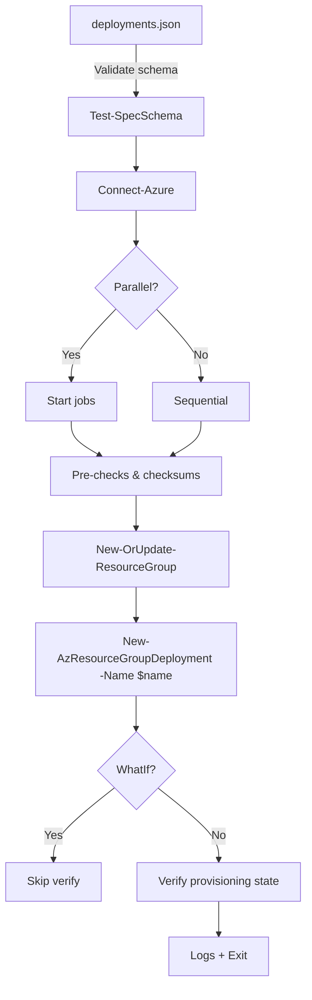

# AzAutoDeploy

[](https://github.com/levent-dogan/AzAutoDeploy/actions/workflows/ci.yml)
[](https://github.com/PowerShell/PowerShell)
[](LICENSE)

**Pro-level PowerShell automation for Azure ARM template deployments**

AzAutoDeploy reads a JSON spec and performs one or more deployments with:
- JSON/schema validation & strong parameter checks
- WhatIf simulation (SupportsShouldProcess)
- Optional parallel execution (PS 7+)
- Resource Group auto-provisioning with governance tags
- Retry with exponential backoff (safe defaults)
- Template & parameter checksum verification (SHA256)
- Post-deployment verification (ProvisioningState)
- Timestamped logging (console + file) with secret redaction

---

## Repository Layout
```
AzAutoDeploy/
├─ AzAutoDeploy.ps1
├─ deployments.json
├─ README.md
├─ .gitignore
├─ schemas/
│  └─ azautodeploy.schema.json
├─ templates/
├─ parameters/
├─ examples/
│  ├─ dev/deployments.json
│  └─ prod/deployments.json
├─ tests/
│  └─ AzAutoDeploy.Tests.ps1
└─ .github/workflows/
   └─ ci.yml
```

---

## Quick Start

### Prerequisites
- **PowerShell 7.4+** (recommended) or Windows PowerShell 5.1
- **Az.Resources** module (auto-installs if missing)
- Azure account with RG + deployment permissions

### Install
```bash
git clone https://github.com/levent-dogan/AzAutoDeploy.git
cd AzAutoDeploy
```
```powershell
Set-ExecutionPolicy -Scope CurrentUser -ExecutionPolicy RemoteSigned
```

### Run
```powershell
# Dry-run (no changes)
.\AzAutoDeploy.ps1 -SpecFile .\deployments.json -WhatIf

# Real deployment with 3 parallel jobs (PS 7+)
.\AzAutoDeploy.ps1 -SpecFile .\deployments.json -Parallel 3

# Custom log path
.\AzAutoDeploy.ps1 -SpecFile .\deployments.json -LogFile .\logs\deploy.log
```

---

## Spec: `deployments.json`
Minimal, IDE-friendly sample:
```json
{
  "$schema": "https://example.com/schemas/azautodeploy.schema.json",
  "version": "1.1",
  "subscriptionId": "00000000-0000-0000-0000-000000000000",
  "deployments": [
    {
      "name": "AppService-Dev-2025-01",
      "resourceGroup": {
        "name": "rg-AppService-Dev",
        "location": "East US",
        "tags": { "environment": "Dev", "owner": "TeamA", "project": "CoolApp" }
      },
      "template": { "file": "templates/appservice.json", "checksum": "sha256:<hex>" },
      "parameters": {
        "file": "parameters/appservice.dev.parameters.json",
        "checksum": "sha256:<hex>",
        "overrides": { "sku": "S1" }
      },
      "mode": "Incremental",
      "preChecks": { "requireLogin": true, "validateTemplateFile": true, "validateParameterFile": true, "validateResourceGroupName": true },
      "retryPolicy": { "maxAttempts": 3, "delaySeconds": 15, "backoffFactor": 2 }
    }
  ]
}
```
**Notes**
- `name` is used as **Azure deployment name** (`-Name`); **unique within the RG**.
- `subscriptionId` supported **top-level** or **per-deployment**; context switches automatically.
- `parameters.checksum` (optional) verifies file integrity.
- Parameter sources: file, inline `overrides`, or both (merged; overrides win).

---

## CI / Quality
- **CI**: GitHub Actions (`.github/workflows/ci.yml`) runs PSScriptAnalyzer + Pester.
- **Lint Rules**: `pssa.ruleset.json`
- **Tests**: `tests/AzAutoDeploy.Tests.ps1` (mocks; Azure connection not required)

Add the badge to your README (already at top):
```
[](https://github.com/levent-dogan/AzAutoDeploy/actions/workflows/ci.yml)
```

---

## Troubleshooting
- **Login/permissions**: `Connect-AzAccount` and confirm tenant/subscription + RBAC.
- **Checksum mismatch**: `Get-FileHash -Algorithm SHA256` and update spec.
- **Parallel errors**: Use **PowerShell 7+**; or run with `-Parallel 1`.
- **Deployment name in use**: Change `name` or remove old failed runs.

---

## Design Overview


---

## License
**MIT** — see `LICENSE` (add the file if missing).

## Contributing
1. Fork the repo
2. Create a feature branch
3. Update schema/tests/docs
4. Submit a PR with a clear description
